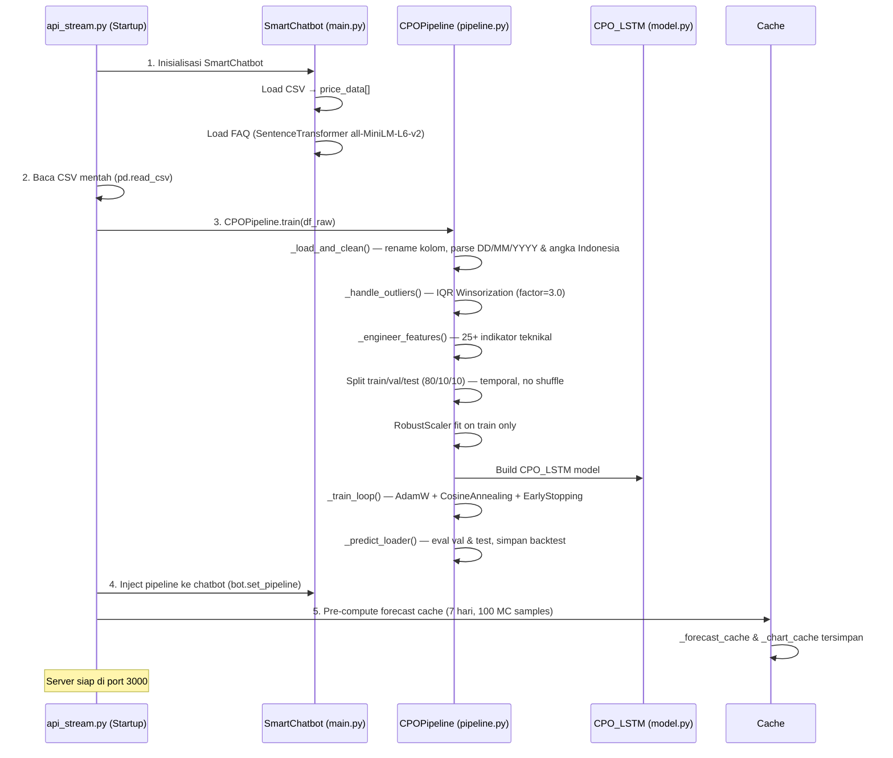

# 🌴 Chatbot INL — Sistem Informasi & Prediksi Harga CPO

> **Backend system** untuk **PT Industri Nabati Lestari (INL)** — anak perusahaan PTPN III (Persero), bergerak di pengolahan minyak kelapa sawit di KEK Sei Mangkei, Sumatera Utara.

---

## 📌 Ringkasan Proyek

Sistem ini terdiri dari **3 komponen utama** yang berjalan secara bersamaan:

| Komponen | Deskripsi | Port |
|----------|-----------|------|
| 🤖 **Chatbot "Sobat INL"** | Tanya-jawab seputar harga CPO, prediksi, dan profil perusahaan | `3000` |
| 📈 **LSTM Forecasting** | Prediksi harga CPO 7 hari ke depan (train-in-runtime) | `3000` |
| 🌲 **RF Production Analysis** | Analisis produksi RBDPO menggunakan Random Forest + LOOCV | `3001` |

---

## 📁 Struktur Proyek

```
├── chatbot/                            ← MODUL UTAMA (Port 3000)
│   ├── api_stream.py                   ← Entry point server utama — FastAPI v2.0.0
│   ├── api.py                          ← API alternatif (endpoint /train upload CSV)
│   ├── main.py                         ← SmartChatbot class + data loading dari CSV
│   ├── pipeline.py                     ← CPOPipeline: end-to-end ML pipeline (in-memory)
│   ├── model.py                        ← CPO_LSTM: arsitektur model PyTorch
│   ├── forecast_handler.py             ← CPOForecaster (legacy, tidak digunakan aktif)
│   ├── config_keywords.py              ← Intent keywords, persona "Sobat INL", small talk
│   ├── price_analytics.py              ← Analisis statistik harga historis
│   ├── faq_handler.py                  ← Semantic search FAQ (SentenceTransformer)
│   ├── schemas.py                      ← Pydantic request/response models
│   ├── CPO_LSTM_Prediction_(1).ipynb   ← Notebook riset & referensi pipeline
│   └── step*.png                       ← Visualisasi tahapan dari notebook
│
├── rf_production/                      ← MODUL RANDOM FOREST (Port 3001)
│   ├── rf_api.py                       ← FastAPI server RF — v2.1.0
│   ├── rf_data_loader.py               ← Pipeline data: API produksi → JSON → Excel
│   ├── rf_data_loader1.py              ← Versi alternatif data loader
│   ├── rf_model.py                     ← RandomForest + LOOCV + Feature Importance
│   └── rf_schemas.py                   ← Pydantic schemas untuk RF API
│
├── data/                               ← DATASET & MODEL FILES
│   ├── Data Historis Minyak Sawit AS Berjangka.csv   ← Dataset utama (harga CPO USD/MT)
│   ├── Data Historis Minyak Sawit Berjangka.csv      ← Dataset alternatif
│   ├── Data_Historis_CPO_dengan_Kurs.csv             ← Dataset CPO + kurs MYR/IDR
│   ├── Rekap Harga CPO 2021-2025 (New Rev.0).xlsx    ← Rekap harga tahunan
│   ├── kurs_myr_idr_harian_full.csv                  ← Data kurs harian lengkap
│   ├── cpo_lstm_model.pth                            ← Pre-trained model (legacy)
│   ├── cpo_lstm_model_v2.pth                         ← Pre-trained model v2 (legacy)
│   ├── model_cpo_lstm.keras                          ← Model Keras (legacy)
│   ├── scaler.pkl                                    ← Scaler tersimpan (legacy)
│   ├── dataset_cpo.json                              ← Dataset CPO format JSON
│   ├── dataset_cpo_reuters.json                      ← Dataset CPO dari Reuters
│   ├── laporan produksi.json                         ← Data produksi dari API
│   ├── stok cpo.json                                 ← Data stok CPO
│   ├── target produksi.json                          ← Target RKAP
│   ├── faq.txt                                       ← Knowledge base profil INL
│   ├── harga tender cpo kpbn (1).xlsx                ← Harga tender KPBN
│   ├── kpbn reuters.xlsx                             ← Data KPBN Reuters
│   ├── excel/                                        ← Daily Report Excel 2021–2023
│   └── production/                                   ← Data produksi historis
│
└── venv/                               ← Python virtual environment
```

---

## 🔄 Alur Startup & Data Flow



---

## 🧠 Arsitektur Model: CPO_LSTM

```
Input → (batch, seq_len=20, n_features=~28)
   │
   ├── LSTM Stack
   │     2 layers, hidden=128, unidirectional, dropout=0.3
   │     Output: (batch, seq_len, 128)
   │
   ├── Attention Layer (Bahdanau-style additive)
   │     → Weighted context vector (batch, 128)
   │
   └── FC Regression Head
         LayerNorm → Linear(128→64) → GELU → Dropout
         → Linear(64→32) → GELU → Linear(32→1)
         Output: scalar (harga Close ter-scale)
```

### ⚙️ Konfigurasi Training

| Parameter | Nilai |
|-----------|-------|
| Sequence Length | 20 |
| Hidden Size | 128 |
| Num Layers | 2 |
| Bidirectional | `False` |
| Attention | `True` |
| Epochs (max) | 200 |
| Batch Size | 64 |
| Learning Rate | 0.0005 |
| Optimizer | AdamW (weight_decay=1e-5) |
| Loss Function | HuberLoss (δ=0.5) |
| Scheduler | CosineAnnealingLR (T_max=50) |
| Early Stopping | patience=15, min_delta=1e-6 |
| Scaler | RobustScaler |
| Outlier Handling | IQR Winsorization (factor=3.0) |
| Seed | 42 |

### 📊 Feature Engineering (25+ Fitur)

| Kategori | Fitur |
|----------|-------|
| **Moving Average** | MA_7, MA_21, MA_50 |
| **EMA** | EMA_12, EMA_26 |
| **MACD** | MACD, MACD_Signal, MACD_Hist |
| **RSI** | RSI (14-period) |
| **Bollinger Bands** | Bollinger_Upper, Bollinger_Lower, BB_Width (20-period, 2σ) |
| **Volatility** | Volatility_7, Volatility_30 |
| **Momentum** | Momentum_5, Momentum_14 |
| **Lag Features** | Close_Lag_1, Close_Lag_3, Close_Lag_7 |
| **Price Ratios** | HL_Ratio, OC_Ratio |
| **Calendar** | DayOfWeek, Month, Quarter |

---

## 📡 API Endpoints

### Server 1: Chatbot + LSTM Forecast — Port 3000 (`api_stream.py`)

| Method | Endpoint | Deskripsi |
|--------|----------|-----------|
| `POST` | `/chat` | Chatbot streaming per kata (SSE / text/plain) |
| `GET` | `/forecast-data` | Data grafik Chart.js (aktual 2025+ & 7 hari prediksi + backtest overlay) |
| `GET` | `/forecast` | Detail forecast + confidence interval (50% & 90%) dari cache |
| `GET` | `/metrics` | MAE, RMSE, MAPE, R², Directional Accuracy (val & test) |
| `GET` | `/status` | Status sistem: chatbot_ready, pipeline_ready, data_rows, dll |

#### Format Response `/forecast-data`

```json
{
  "status": "ok",
  "categories": ["2025-01-02", "...", "2025-05-30", "2025-06-02", "..."],
  "actual": [1135.5, "...", 1142.0, null, null],
  "prediction": [null, "...", 1142.0, 1148.3, "..."],
  "lower_90": [...],
  "upper_90": [...],
  "lower_50": [...],
  "upper_50": [...],
  "last_known": 1142.0,
  "mc_samples": 100,
  "backtest_overlay": [null, "...", 1138.2, null],
  "backtest": { "dates": [...], "actual": [...], "predicted": [...] }
}
```

---

### Server 2: RF Production Analysis — Port 3001 (`rf_api.py`)

| Method | Endpoint | Deskripsi |
|--------|----------|-----------|
| `GET` | `/rf-analysis` | Analisis lengkap: feature importance + historis + evaluasi LOOCV |
| `GET` | `/rf-feature-importance` | Peringkat fitur berpengaruh (MDI + Permutation Importance) |
| `GET` | `/rf-production-history` | Data historis siap pakai untuk grafik ApexCharts (Vue.js) |
| `GET` | `/rf-health` | Health check: status API produksi, cache info, daftar endpoint |
| `POST` | `/rf-invalidate-cache` | Paksa hitung ulang model di request berikutnya |
| `GET` | `/docs` | Swagger UI dokumentasi interaktif |

---

### API Alternatif — Port 8000 (`api.py`)

| Method | Endpoint | Deskripsi |
|--------|----------|-----------|
| `POST` | `/train` | Upload CSV, latih model baru, simpan `.pth` |
| `GET` | `/forecast` | Prediksi 7 hari (horizon + mc_samples dapat dikustomisasi) |
| `POST` | `/predict` | Prediksi 1-step dari CSV custom |
| `GET` | `/metrics` | Metrik performa model |
| `GET` | `/model-info` | Arsitektur & konfigurasi model aktif |
| `GET` | `/health` | Health check |

---

## 🤖 Chatbot "Sobat INL"

### Alur Klasifikasi Intent

```
User Query
   │
   ├── Small Talk? (halo, bye, kabar, terima kasih)
   │     → Fixed response dari config_keywords.py
   │
   ├── Ada pola tanggal spesifik? (DD MMMM YYYY)
   │     → find_price_by_date() → cari exact match di CSV
   │
   ├── FORECAST (prediksi, besok, besok lusa, ke depan, minggu depan)
   │     → Gunakan _forecast_cache (SAMA dengan grafik dashboard)
   │     → Potong horizon sesuai permintaan (1–30 hari)
   │
   ├── INFO_COMPANY (profil, direktur, lokasi, sejarah, kapasitas)
   │     → FAQHandler.search() — semantic + keyword boosting
   │
   ├── ANALYSIS (tertinggi, terendah, rata-rata, tahun XXXX)
   │     → PriceAnalyzer.analyze() → statistik periode
   │
   └── GENERAL (default)
         → PriceAnalyzer (30 hari terakhir)
```

### LLM Backend

| Parameter | Nilai |
|-----------|-------|
| Model | `qwen3-coder:480b-cloud` |
| Server | Ollama (`localhost:11434`) |
| Persona | "Sobat INL" — asisten virtual PT INL |
| Temperature | 0.1 (deterministik) |
| Timeout | 300.000 ms |

### FAQ Handler (`faq_handler.py`)

| Parameter | Nilai |
|-----------|-------|
| Embedding Model | `all-MiniLM-L6-v2` (SentenceTransformer) |
| Similarity | Cosine similarity |
| Keyword Boosting | +0.35 per kata kunci cocok |
| Threshold | 0.25 |
| Top-K | 3 (chatbot) / 5 (default) |
| Knowledge Base | `data/faq.txt` — profil lengkap PT INL |

---

## 🌲 Random Forest Production Analysis

### Tujuan
Memprediksi **Realisasi Produksi RBDPO** (Refined Bleached Deodorized Palm Oil) bulanan PT INL menggunakan Random Forest dengan validasi LOOCV.

### Sumber Data (3 Layer, Prioritized)

| Prioritas | Sumber | Keterangan |
|-----------|--------|------------|
| 1 | **API Produksi** (`103.176.66.42:9009`) | Data real-time 2024+ |
| 2 | **JSON Lokal** (`data/laporan produksi.json`, dll) | Fallback jika API tidak tersedia |
| 3 | **Excel Daily Report** (`data/excel/`) | Data historis 2021–2023 |

### 🌲 Arsitektur Model: Random Forest

```
Input (n_bulan × 14 fitur)
   │
   ├── Ensemble: 500 Decision Trees
   │     Setiap pohon dilatih pada bootstrap sample
   │     Feature subsampling: sqrt(14) ≈ 3–4 fitur per split
   │
   ├── Voting Agregasi
   │     Rata-rata prediksi dari seluruh 500 pohon
   │     → Output: Realisasi RBDPO (ton/bulan)
   │
   └── Post-training Analysis
         ├── MDI Feature Importance  ← impurity-based, dari seluruh pohon
         └── Permutation Importance  ← model-agnostic, 50 pengulangan
```

#### Validasi: Leave-One-Out Cross Validation (LOOCV)

```
Dataset: N bulan data
   │
   ├── Iterasi 1: Train [bulan 2..N] → Predict bulan 1
   ├── Iterasi 2: Train [bulan 1, 3..N] → Predict bulan 2
   ├── ...
   └── Iterasi N: Train [bulan 1..N-1] → Predict bulan N
         │
         └── Agregasi → MAE, RMSE, MAPE, R²
```

> LOOCV dipilih karena dataset produksi bulanan relatif kecil — memaksimalkan data training di setiap fold.

### Konfigurasi Model RF

| Parameter | Nilai |
|-----------|-------|
| Algorithm | `RandomForestRegressor` |
| n_estimators | 500 |
| max_features | `sqrt` |
| Validasi | Leave-One-Out Cross Validation (LOOCV) |
| Feature Importance | MDI + Permutation Importance (50 repeats) |
| random_state | 42 |
| n_jobs | -1 (semua core) |

### Fitur Model (14 Fitur)

| Fitur | Deskripsi |
|-------|-----------|
| `stok_rata2` | Rata-rata stok CPO harian |
| `stok_max` | Stok CPO maksimum |
| `stok_hari_aktif` | Hari stok aktif |
| `target_rkap` | Target produksi RKAP |
| `cpo_consume` | Total CPO dikonsumsi |
| `hari_olah` | Hari pabrik beroperasi |
| `yield_rbdpo` | Yield RBDPO (%) |
| `pfad_total` | Produk samping PFAD |
| `cpo_per_hari` | Intensitas produksi per hari |
| `bulan_ke` | Bulan dalam setahun (1–12) |
| `kuartal` | Kuartal (1–4) |
| `realisasi_prev` | Realisasi bulan sebelumnya |
| `cpo_prev` | CPO consume bulan sebelumnya |
| `hari_olah_prev` | Hari olah bulan sebelumnya |

### Sistem Cache RF

| Parameter | Nilai |
|-----------|-------|
| TTL | 7.200 detik (2 jam) |
| Pre-compute | Saat startup (async via executor) |
| Thread-safety | `threading.Lock` |
| Invalidasi manual | `POST /rf-invalidate-cache` |

---

## 🚀 Cara Menjalankan

### Prasyarat

```bash
# Aktifkan virtual environment
venv\Scripts\activate       # Windows
source venv/bin/activate    # Linux/Mac

# Install dependencies
pip install fastapi uvicorn torch scikit-learn pandas numpy
pip install sentence-transformers pydantic requests openpyxl
```

### Menjalankan Server Chatbot + LSTM (Port 3000)

```bash
cd chatbot
python api_stream.py
```

> ⚠️ Server akan melatih model LSTM dari awal saat startup (~2–5 menit tergantung hardware).

### Menjalankan Server RF Production (Port 3001)

```bash
cd rf_production
python rf_api.py
```

> ⚠️ Server akan pre-compute LOOCV saat startup (~1–3 menit).

### Menjalankan Server API Alternatif (Port 8000)

```bash
cd chatbot
python api.py
```

---

## ⚠️ Catatan Teknis Penting

### 1. Train-in-Runtime (No `.pth` Export)
Model LSTM **dilatih setiap kali server start** dari CSV mentah. Tidak ada file `.pth` yang diexport. Ini menjamin konsistensi 100% antara training dan inference. File `.pth` di folder `data/` adalah legacy dan tidak digunakan oleh `api_stream.py`.

### 2. Forecast Cache (Single Source of Truth)
Prediksi 7 hari dihitung **SEKALI** saat startup (100 MC Dropout samples), lalu disimpan di `_forecast_cache` dan `_chart_cache`. Baik endpoint `/forecast-data`, `/forecast`, maupun jawaban chatbot semuanya menggunakan cache yang **SAMA** — angka selalu konsisten.

### 3. Backtest Overlay
Selain prediksi masa depan, grafik dashboard juga menampilkan **overlay backtest** — prediksi model pada periode test historis, disandingkan dengan harga aktual untuk visualisasi akurasi model.

### 4. Double-Parse Bug Prevention
`api_stream.py` membaca CSV mentah langsung (`pd.read_csv`) dan menyerahkan ke `pipeline._load_and_clean()` untuk parsing. Ini menghindari angka Indonesia (format `1.140,25`) di-parse dua kali (bug yang menghasilkan nilai terdistorsi).

### 5. Format Data CSV
Dataset harga CPO dalam **USD per Metric Ton (USD/MT)** — format Indonesia:
- Pemisah ribuan: titik (`.`) → `1.140`
- Pemisah desimal: koma (`,`) → `1.140,25` = 1140.25
- Format tanggal: `DD/MM/YYYY`

### 6. Duplikasi Kode
`forecast_handler.py` dan `pipeline.py` memiliki logika yang hampir identik. `pipeline.py` adalah **versi production** yang digunakan oleh `api_stream.py`. `forecast_handler.py` adalah versi **legacy** yang tidak aktif digunakan.

---

## 📦 Stack Teknologi

| Kategori | Library / Tool |
|----------|---------------|
| **Web Framework** | FastAPI, Uvicorn |
| **Deep Learning** | PyTorch (LSTM, Attention) |
| **ML / Statistik** | scikit-learn (RandomForest, LOOCV, RobustScaler) |
| **Data Processing** | Pandas, NumPy |
| **NLP / Embedding** | SentenceTransformers (`all-MiniLM-L6-v2`) |
| **LLM Backend** | Ollama (`qwen3-coder:480b-cloud`) |
| **Data Validation** | Pydantic v2 |
| **File Format** | CSV (harga CPO), JSON (produksi/stok), Excel (daily report) |
