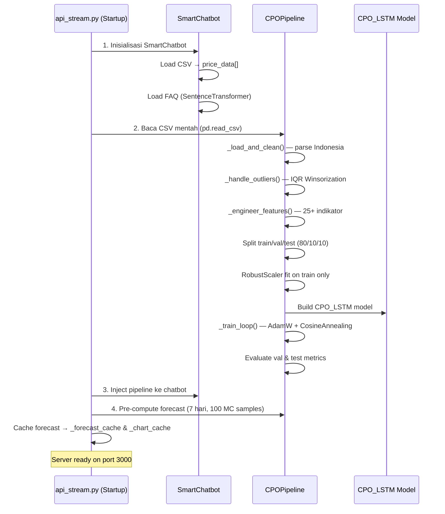

# 🌴 Project Overview: Chatbot INL (`D:\chatbot inl\chatbot`)

## Ringkasan Proyek

Ini adalah **backend system** untuk **PT Industri Nabati Lestari (INL)** — anak perusahaan PTPN III (Persero) yang bergerak di pengolahan minyak kelapa sawit di KEK Sei Mangkei, Sumatera Utara.

Sistem terdiri dari **3 komponen utama**:

| Komponen | Fungsi | Port |
|----------|--------|------|
| **Chatbot "Sobat INL"** | Tanya-jawab seputar CPO, harga, profil perusahaan | Port 3000 |
| **LSTM Forecasting** | Prediksi harga CPO 7 hari ke depan | Port 3000 (same server) |
| **RF Production Analysis** | Analisis produksi RBDPO dengan Random Forest | Port 3001 |

---

## 📁 Struktur Proyek

```
D:\chatbot inl\
├── chatbot/                      ← MODUL UTAMA
│   ├── api_stream.py             ← FastAPI server utama (port 3000) — entry point
│   ├── api.py                    ← API alternatif (standalone training endpoint)
│   ├── main.py                   ← SmartChatbot class + data loading
│   ├── pipeline.py               ← CPOPipeline: full ML pipeline (train-in-runtime)
│   ├── model.py                  ← CPO_LSTM: PyTorch model architecture
│   ├── forecast_handler.py       ← CPOForecaster (legacy, duplikasi pipeline.py)
│   ├── config_keywords.py        ← Intent keywords, persona, small talk
│   ├── price_analytics.py        ← Analisis statistik harga historis
│   ├── faq_handler.py            ← Semantic search FAQ (SentenceTransformer)
│   ├── schemas.py                ← Pydantic request/response models
│   ├── CPO_LSTM_Prediction_(1).ipynb  ← Notebook referensi (research)
│   └── step*.png                 ← Visualisasi dari notebook
│
├── rf_production/                ← MODUL RANDOM FOREST
│   ├── rf_api.py                 ← FastAPI server RF (port 3001)
│   ├── rf_data_loader.py         ← Data pipeline: API → JSON → Excel
│   ├── rf_model.py               ← Random Forest + LOOCV + Feature Importance
│   └── rf_schemas.py             ← Pydantic schemas RF
│
├── data/                         ← DATASET
│   ├── Data Historis Minyak Sawit AS Berjangka.csv  ← Dataset utama (harga CPO USD/MT)
│   ├── cpo_lstm_model.pth        ← Pre-trained LSTM model (legacy)
│   ├── faq.txt                   ← Knowledge base perusahaan INL
│   ├── dataset_cpo.json          ← Dataset CPO format JSON
│   ├── laporan produksi.json     ← Data produksi dari API
│   ├── stok cpo.json             ← Data stok CPO
│   ├── target produksi.json      ← Target RKAP
│   ├── excel/                    ← Excel Daily Report 2021-2023
│   └── ...
│
└── venv/                         ← Python virtual environment
```

---

## 🔄 Alur Data & Startup Flow



---

## 🧠 Model Architecture: CPO_LSTM

```
Input (batch, seq_len=20, n_features=28+)
  │
  ├── LSTM Stack (2 layers, hidden=128, bidirectional=True, dropout=0.3)
  │     Output: (batch, seq_len, 256)
  │
  ├── Attention Layer (Bahdanau-style additive)
  │     → Weighted context vector (batch, 256)
  │
  └── FC Regression Head
        LayerNorm → Linear(256→64) → GELU → Dropout
        → Linear(64→32) → GELU → Linear(32→1)
        Output: scalar (predicted Close price, scaled)
```

### Training Config (identik dengan notebook):
| Parameter | Value |
|-----------|-------|
| Sequence Length | 20 |
| Hidden Size | 128 |
| Num Layers | 2 |
| Bidirectional | False |
| Attention | True |
| Epochs | 200 (max) |
| Batch Size | 64 |
| Learning Rate | 0.0005 |
| Optimizer | AdamW |
| Loss | HuberLoss(δ=0.5) |
| Scheduler | CosineAnnealing(T_max=50) |
| Early Stopping | patience=15, min_delta=1e-6 |
| Scaler | RobustScaler |
| Outlier Handling | IQR Winsorization (factor=3.0) |

### Feature Engineering (25+ features):
- **Moving Averages**: MA_7, MA_21, MA_50
- **EMA**: EMA_12, EMA_26
- **MACD**: MACD, MACD_Signal, MACD_Hist
- **RSI**: 14-period
- **Bollinger Bands**: Upper, Lower, BB_Width (20-period, 2σ)
- **Volatility**: 7-day, 30-day
- **Momentum**: 5-day, 14-day
- **Lag Features**: Close_Lag_1, Close_Lag_3, Close_Lag_7
- **Ratios**: HL_Ratio, OC_Ratio
- **Calendar**: DayOfWeek, Month, Quarter

---

## 📡 API Endpoints

### Server 1: Chatbot + LSTM Forecast (Port 3000)

| Method | Endpoint | Fungsi |
|--------|----------|--------|
| `POST` | `/chat` | Chatbot streaming (SSE per kata) |
| `GET` | `/forecast-data` | Data grafik Chart.js (30 hari aktual + 7 hari prediksi) |
| `GET` | `/forecast` | Detail forecast + confidence interval |
| `GET` | `/metrics` | MAE, RMSE, MAPE, R², Directional Accuracy |
| `GET` | `/status` | Status sistem keseluruhan |

### Server 2: Random Forest Analysis (Port 3001)

| Method | Endpoint | Fungsi |
|--------|----------|--------|
| `GET` | `/rf-analysis` | Analisis lengkap (FI + historis + LOOCV) |
| `GET` | `/rf-feature-importance` | Feature importance saja |
| `GET` | `/rf-production-history` | Data historis untuk grafik ApexCharts |
| `GET` | `/rf-health` | Health check + cache info |
| `POST` | `/rf-invalidate-cache` | Force cache refresh |

---

## 🤖 Chatbot "Sobat INL"

### Intent Classification Flow:
```
User Query
  │
  ├── Small Talk? (halo, bye, kabar) → Fixed response
  ├── Tanggal spesifik? → Cari harga di CSV
  ├── FORECAST? (prediksi, besok, ke depan) → CPOPipeline.forecast()
  ├── INFO_COMPANY? (profil, direktur, lokasi) → FAQ semantic search
  ├── ANALYSIS? (tertinggi, rata-rata, historis) → PriceAnalyzer
  └── GENERAL → PriceAnalyzer (default 30 hari terakhir)
```

### LLM Backend:
- **Model**: Qwen3-Coder 480B (via Ollama, localhost:11434)
- **Persona**: "Sobat INL" — asisten virtual PT INL
- **Temperature**: 0.1 (deterministic)

### FAQ Handler:
- **Embedding**: `all-MiniLM-L6-v2` (SentenceTransformer)
- **Search**: Cosine similarity + keyword boosting (+0.35 score)
- **Knowledge Base**: `data/faq.txt` (73 lines, profil perusahaan lengkap)

---

## 🌲 Random Forest Production Analysis

### Tujuan:
Memprediksi **Realisasi Produksi RBDPO** (Refined Bleached Deodorized Palm Oil) bulanan.

### Data Sources (3 layer, prioritized):
1. **API Production** (`103.193.145.61:9009`) — data 2024+
2. **JSON Lokal** — fallback jika API mati
3. **Excel Daily Report** — data historis 2021-2023

### Model:
- **Algorithm**: RandomForestRegressor (500 trees, sqrt features)
- **Validation**: Leave-One-Out Cross Validation (LOOCV)
- **Features (14)**: stok_rata2, stok_max, target_rkap, cpo_consume, hari_olah, yield_rbdpo, pfad_total, cpo_per_hari, bulan_ke, kuartal, realisasi_prev, cpo_prev, hari_olah_prev, stok_hari_aktif

### Caching:
- TTL: 2 jam
- Pre-computed saat startup
- Thread-safe dengan Lock

---

## ⚠️ Catatan Teknis Penting

1. **Train-in-Runtime**: Model LSTM dilatih setiap kali server start — tidak ada file `.pth` yang diexport. Ini menjamin konsistensi 100% antara training dan inference.

2. **Forecast Cache**: Prediksi dihitung **SEKALI** saat startup (100 MC Dropout samples), lalu di-cache. Grafik dashboard dan chatbot menggunakan cache yang **SAMA** → angka konsisten.

3. **Double-Parse Bug Prevention**: `api_stream.py` membaca CSV mentah langsung dan menyerahkan ke `pipeline._load_and_clean()` untuk parsing. Ini menghindari parsing angka Indonesia dua kali.

4. **Duplikasi Code**: `forecast_handler.py` dan `pipeline.py` memiliki logika yang hampir identik. `pipeline.py` adalah versi production yang digunakan oleh `api_stream.py`, sedangkan `forecast_handler.py` adalah versi legacy.

5. **Dataset**: Data harga CPO dalam **USD per Metric Ton (USD/MT)** — format Indonesia (titik=ribuan, koma=desimal, contoh: "1.140,25" → 1140.25).
